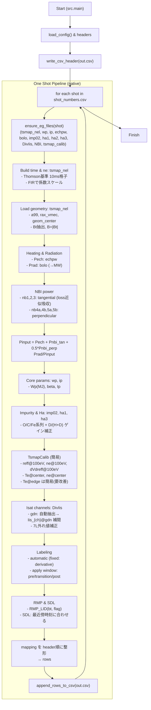

# ネイティブパイプライン設計と処理フロー（日本語）

本ドキュメントは、`src` レイヤへ全面移植したネイティブパイプラインの構成・処理の流れ・主要モジュールをまとめたものです。併せて、実行方法や今後の改善ポイントも記載します。

## 処理フロー（Mermaid）

## 実行方法

- 基本: `python -m src.main`
- 手動/自動の切替のみ:
  - 手動タイミング指定: `python -m src.main --mode manual`
  - 自動タイミング検出（固定手法 = 微分法）: `python -m src.main --mode automatic`

## レイヤと責務

- `src/infrastructure`
  - `clients/lhd_api.py`: LHD WebAPI で EG ファイル取得（`ensure_eg_files`）。
  - `parsers/egdb.py`, `parsers/eg3d.py`: EG 2D/3D ファイルの軽量パーサと補間 API、`gdn:`行の自動抽出。
  - `repositories/sdl_repo.py`: SDL ファイル読み込み（レガシー場所へのフォールバック対応）。
- `src/domain`
  - `params/isat.py`: Isat 取得・7L 外れ値補正。
  - `labeling/detachment.py`: 自動検出（現在は微分法のみ使用）とラベル窓の適用。
  - `params/sdl.py`, `params/rmp.py`: SDL 整列・RMP 算出。
- `src/application`
  - `native_pipeline.py`: 1 ショットのフルパイプライン（取得 → 補間 → 物理量算出 → ラベリング → CSV）。
  - `build_dataset.py`: 既存ユースケースの拡張（RMP/SDL/Isat 等）。
- `src/config`
  - `parameters.yaml`: 出力ヘッダ。`headers = basic_info_for_header + parameters`。
  - `config.yaml`: 出力先ファイル名など。

## 1 ショット処理（native）の詳細

- 時間軸と密度
  - `tsmap_nel@shot.dat` から Thomson 密度を基準に 10ms 格子を構成。
  - FIR との係数スケールを適用（レガシー準拠）。
- 幾何・磁場
  - `a99`, `rax_vmec`, `geom_center` を補間。
  - コメントから `Bt` 抽出（`B = |Bt|`を配列で生成）。
- 加熱・放射
  - `echpw`: `Pech`、`bolo`: `Prad`（kW→MW）。
- NBI パワー
  - Tangential: `nb1/2/3pwr_temporal`。密度依存の損失近似を適用して吸収パワーに換算。
  - Perpendicular: `nb4a/4b/5a/5b...`を合算。
- 入力パワー/比
  - `Pinput = Pech + Pnbi-tan + 0.5*Pnbi-perp`、`Prad/Pinput` を算出。
- コア諸量
  - `wp`: `Wp(MJ)`, `beta`、`ip`: `Ip` を補間取得。
- 不純物・Hα
  - `imp02`: `OV/OVI/CIII/CIV/FeXVI(+HI)` を補間し、ゲイン補正を適用。
  - `ha3`: `D/(H+D)`（閾値下限 0.01）; `ha1`: `HeI`。
- `TsmapCalib`（簡易）
  - `reff@100eV`, `ne@100eV`, `dVdreff@100eV`、`Te@center`, `ne@center` を 3D から抽出 → 時間補間。
  - `Te@edge` は簡易（今後 `phiEdge` 相当実装で厳密化）。
- Isat
  - `DivIis_tor_sum@shot.dat` から `gdn:` 行を自動抽出し、`Iis_{ch}@gdn` を補間。
  - `7L` は外れ値補正（閾値置換＋前値ホールド近似）。
- ラベリング
  - `--mode automatic` 時は「微分法」のみを使用（手法選択は不要）。
  - `apply_window_labels` で pre/transition/post 区間を付与。
- RMP/SDL
  - `RMP_LID = calculate_rmp_lid(Bt, flag)`; SDL は最近傍サンプル整列。
- 出力
  - `parameters.yaml` のヘッダ順に `mapping` を並べて CSV 追記。

## 入出力

- 入力: EG ファイル（WebAPI から自動取得）、`src/config/shot_numbers.csv`（ショット番号）、`src/data/SDLloopdata/Phieff*.dat`。
- 出力: `src/data/datasets/{config.files.output_dataset}`。

## 既知の改善余地（今後のタスク）

- `ISS_Wp` 正式移植（`ISS04`の τ 計算 →`Wp_iss`）と検証。
- `phiEdge` に基づいた厳密な `Te@edge` 再現（`eg3d`の拡張）。
- `MPEXP` 指標の再導入（平滑化・微分スキームの再検証含む）。
- NBI 近似モデルの高度化（チャンネル・Bt 符号・密度依存の妥当性評価）。
- ラベリングの物理条件併用（`Wp`/`Prad`/不純物比 併用のハイブリッド検出）。
- 可視化・レポーティング（検出点、区間塗り分け、サマリ）を `src` に統合。
